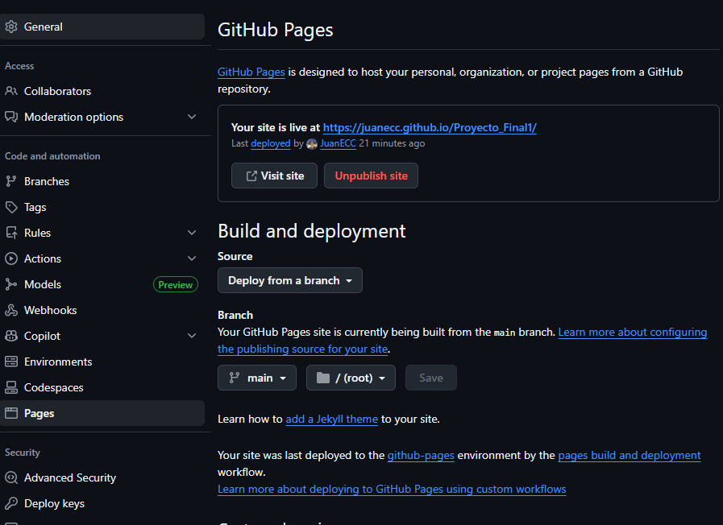
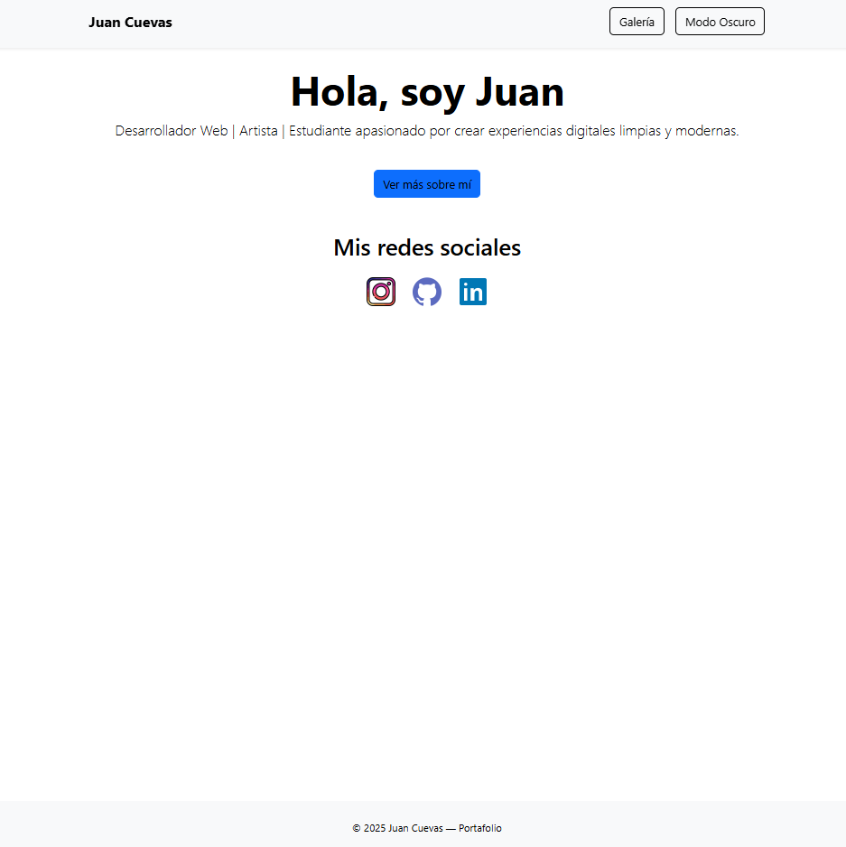
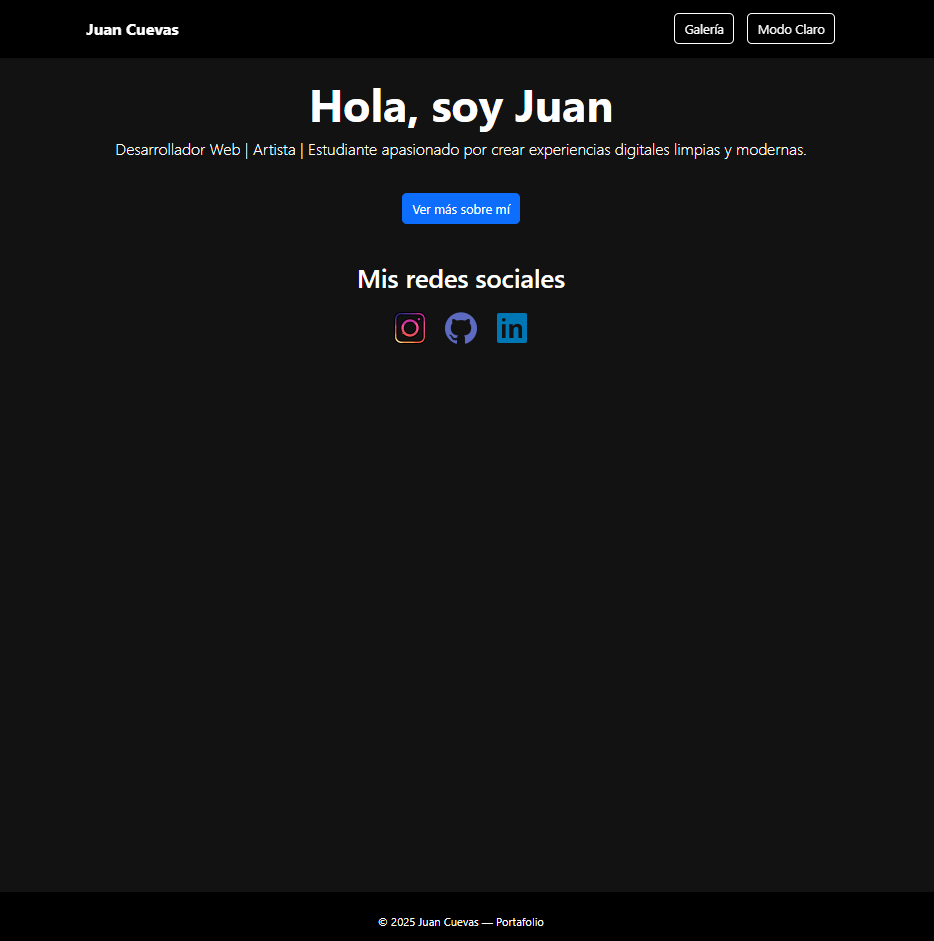
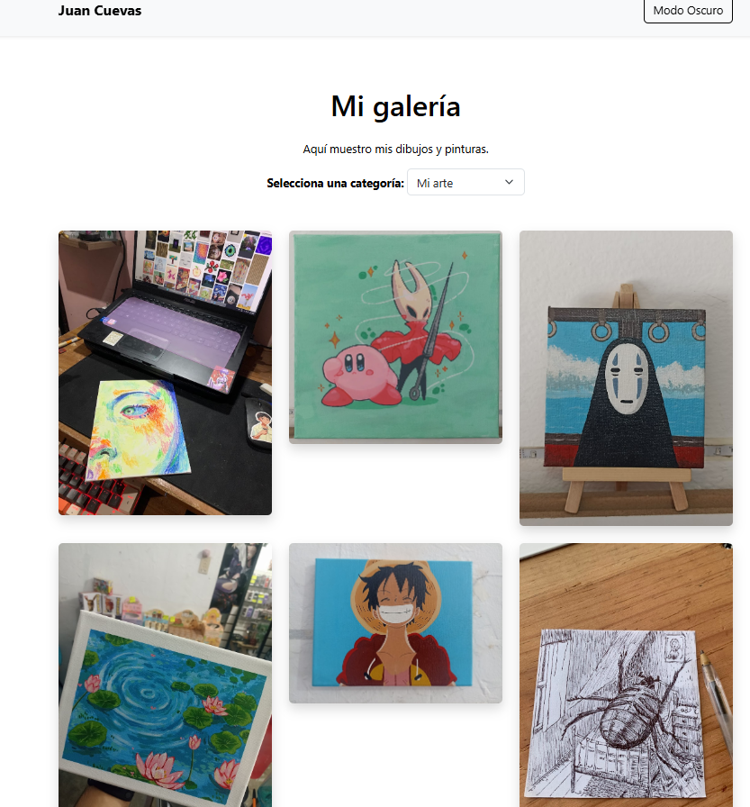
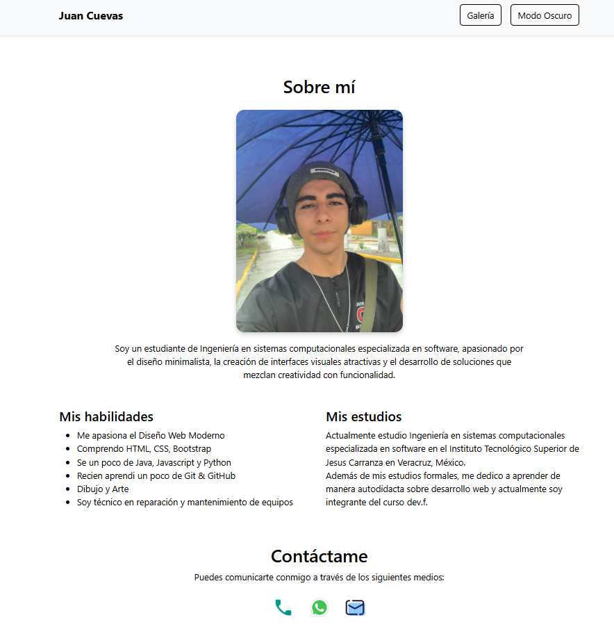

# EVIDENCIAS - Proyecto Final

## 1. URL de GitHub Pages
[Mi página publicada](https://juanecc.github.io/Proyecto_Final1/index.html)

## 2. URL del repositorio
[Repositorio en GitHub](https://github.com/JuanECC/Proyecto_Final1)

## 3. Capturas de pantalla
### a) Settings → Pages

### b) Página en el navegador

---

## 4. Aprendizajes

### a) Lo más fácil y lo más retador
- **Fácil:** Crear la estructura HTML y agregar enlaces.
- **Retador:** Configurar dark/light mode y animaciones.

### b) Etiquetas semánticas utilizadas
- `<header>`, `<nav>`, `<main>`, `<section>`, `<footer>`  
- `<h1>–<h3>`, `
`, `<ul>`, `<ol>`, ``, `<a>`

### c) Organización de commits
- Commits pequeños y descriptivos, separando:
  - `style:` cambios visuales
  - `feat:` funcionalidades nuevas
  - `fix:` correcciones de errores

### d) Mejoras futuras
- Agregar más animaciones sutiles.
- Optimizar imágenes para carga rápida.
- Añadir una página de contacto con formulario real.

COMITS ejeplos.

feat: se creó el archivo styles.css

feat: animaciones globales añadidas

feat: implementación de modo oscuro/claro

feat: archivo script.js creado

feat: texto dinámico del botón

style: nuevos estilos para la nav bar en modo oscuro

style: sombra para imágenes en modo oscuro

feat: nuevos estilos para navbar en modo claro

style: nuevos estilos para botones claros en light mode

style: nuevos estilos para textos en modo claro